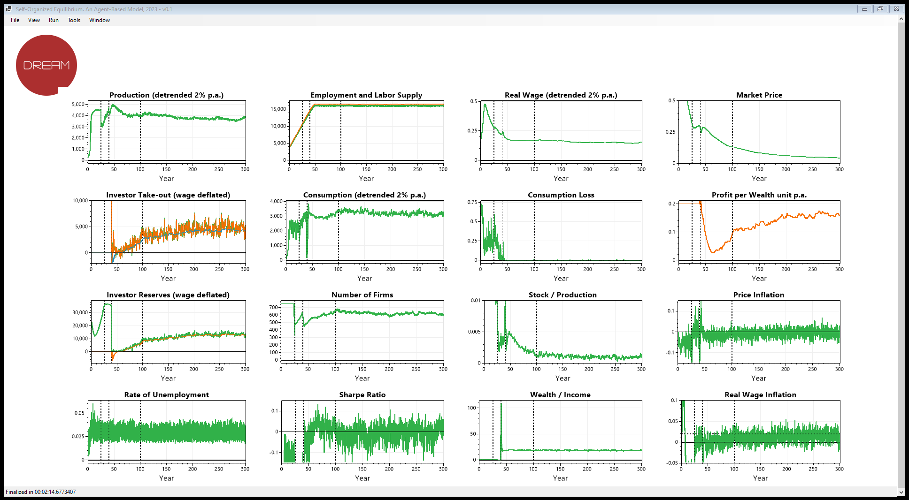

# The Market Economy as a Self-Organizing System

An agent-based model for a decentralized market economy with multiple sectors is set up and it is demonstrated that the economy is self-organizing if four empirically relevant conditions apply: S-shaped production functions, search behavior on the demand side, competition-based price setting and free entry for new firms. 

The model is inspired by Gintis (2007) but differs on several points, for example by not using evolutionary theory. Instead of the evolutionary mechanism of Gintis (2007), we argue for a social mechanism which we call Copy-Deviate behavior. We define Copy-Deviate behavior as a situation where satisfied agents copy each other (which ensures equilibrium), whereas dissatisfied agents deviate from each other and thereby set the system in motion (possibly towards a new equilibrium). It is argued that competition-based pricing known from marketing can be seen as an example of Copy-Deviate behavior.

It is demonstrated that the system is self-organizing by numeric simulation. It is shown that the system follows a balanced growth path where real wages and production grow with the exogenous growth rate. The system is exposed to three supply shocks and it is demonstrated that the model's effects follows conventional economic theory. It is demonstrated that competition-based pricing makes it relatively easy to understand the system, both in- and outside equilibrium. 

The research project is supported by Economic Policy Research Unit (EPRU), Denmark.